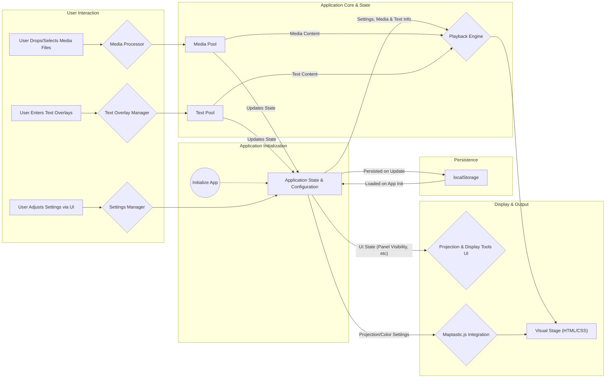
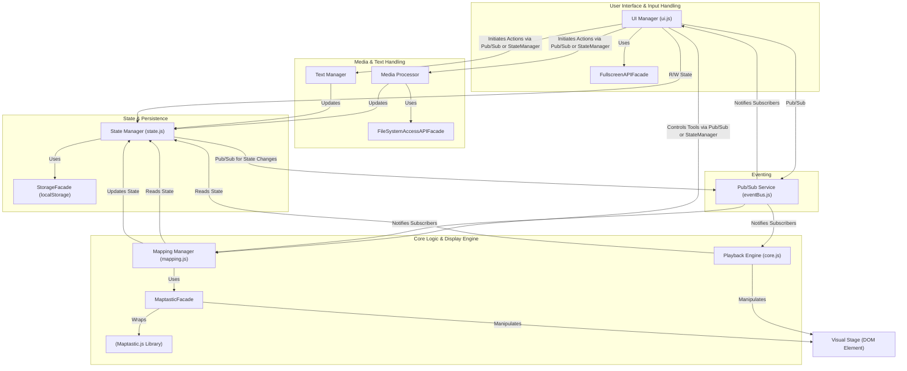
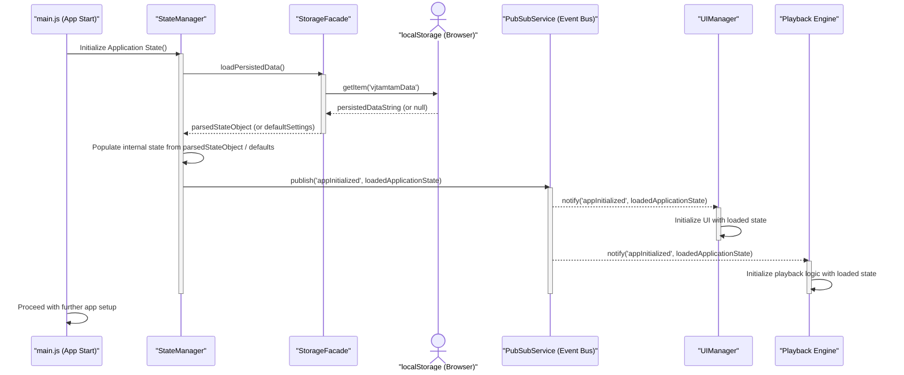
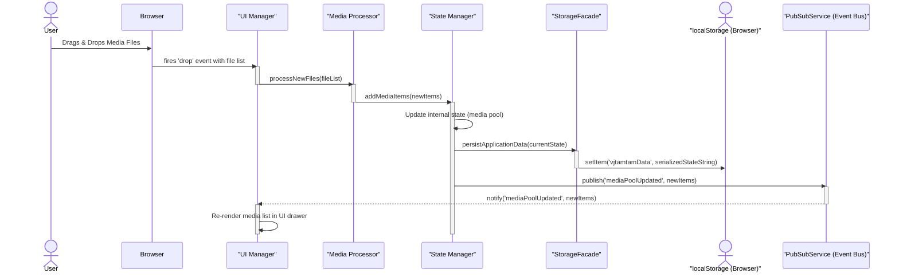
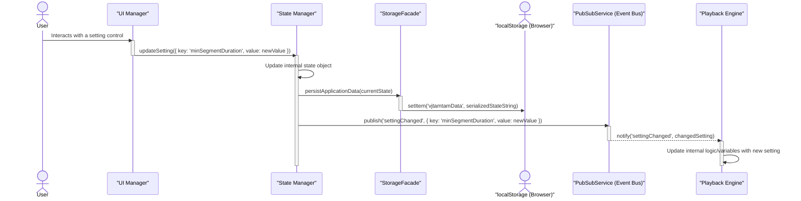

# VJ Tam Tam Architecture Document

## 1. Introduction / Preamble

This document outlines the overall project architecture for VJ Tam Tam, a client-side, web-based "auto VJ" tool.
Its primary goal is to serve as the guiding architectural blueprint for development.
The project mandates **no build process**, prioritizing a direct Vanilla JavaScript, HTML, and CSS implementation.
However, the architecture may incorporate minimal, locally-hosted libraries if they demonstrably and significantly improve code clarity and maintainability for specific concerns like state management or UI component organization, without requiring a build step.
Given this project is entirely client-side with no backend components, this document focuses solely on the frontend architecture, covering its structure, core modules, state management, key library integrations, and operational aspects like persistence and error handling.
It aims to translate the requirements from the Product Requirements Document (PRD) and the UI/UX Specification into a technical plan.

## 2. Table of Contents

1.  Introduction / Preamble
2.  Table of Contents
3.  Technical Summary
4.  High-Level Overview
5.  Architectural / Design Patterns Adopted
6.  Component View
7.  Project Structure
8.  API Reference
9.  Data Models
10. Core Workflow / Sequence Diagrams
11. Definitive Tech Stack Selections
12. Infrastructure and Deployment Overview
13. Overall Testing Strategy
14. Error Handling Strategy
15. Coding Standards
16. Security Best Practices
17. Change Log

## 3. Technical Summary

VJ Tam Tam's architecture is designed as a **client-side monolithic application** built primarily with **pure Vanilla JavaScript (ES Modules), HTML5, and CSS3**, adhering to a strict **no-build-process** requirement.
The architecture may leverage carefully selected, minimal, locally-hosted libraries for specific functionalities, such as state management, if they significantly enhance maintainability without introducing a build step.
Key architectural features include:

- A modular JavaScript structure to manage different aspects of the application: media handling, playback logic, user interface interactions, and advanced display/projection functionalities.
- Direct HTML/CSS rendering for the main visual display stage.
- Integration with **Maptastic.js** (hosted locally) for projection mapping capabilities. [cite: 6, 25]
- Utilization of the native **`FileSystemAccessAPI`** for persisting media file references where supported, with graceful fallbacks. [cite: 26]
- Comprehensive state persistence using **`localStorage`** for all user settings, UI states, and configurations. [cite: 27]
- A custom approach for internal state management and component communication, potentially augmented by minimal, no-build utility libraries. [cite: 28]
- Deployment via **GitHub Pages**, necessitating a simple, flat root directory structure. [cite: 29]
  The architecture prioritizes ease of use for the end-user, robust offline-first functionality after initial load, and adherence to the specific technical constraints outlined in the PRD, with the "no build process" being paramount. [cite: 30]

## 4. High-Level Overview

VJ Tam Tam is architected as a **client-side monolithic application**. [cite: 31]
All application logic, including media processing, playback control, UI rendering, and state management, resides and executes within the user's web browser. [cite: 32]
There is no backend server component for the core functionality. [cite: 33]
The entire codebase will be contained within a **single repository (Monorepo)**, facilitating straightforward deployment to GitHub Pages. [cite: 34]
The primary user interaction flow begins with the user providing media to the application. [cite: 35]
Once media is loaded, the application automatically initiates a continuous, randomized playback of segments from this media pool. [cite: 36]
Users can interact with a minimalist UI to add more media, manage text overlays, and access advanced display controls. [cite: 37]
All settings and configurations are persisted in the browser's `localStorage`. [cite: 38]
Conceptually, the data flow can be visualized as follows:



## 5. Architectural / Design Patterns Adopted

The following architectural and design patterns are proposed for the VJ Tam Tam project to ensure a well-structured, maintainable, and scalable client-side application:

- **Module Pattern (via ES Modules):** We will use ES Modules (`import`/`export`) to organize code into distinct, reusable, and manageable JavaScript files. [cite: 50]
- **Observer Pattern (Publish/Subscribe or "Pub/Sub"):** This pattern will facilitate decoupled communication between different parts of the application (e.g., state changes notifying UI components). [cite: 51]
- **Facade Pattern:** We will use facades to provide simplified, higher-level interfaces to more complex subsystems or libraries like Maptastic.js, FileSystemAccessAPI, and `localStorage`. [cite: 52]
- **State Management Pattern (Custom Centralized State with Defined Mutators):** A central JavaScript object will hold the application's shared state. Access and modifications will be handled through defined functions (mutators), and changes will be broadcast using the Observer pattern.
- **Singleton Pattern:** For certain global services or managers where only one instance should exist (e.g., a StorageFacade or a global Pub/Sub dispatcher), the Singleton pattern will ensure a single point of access. [cite: 55]

## 6. Component View

The VJ Tam Tam application will be structured into several key logical components, each with distinct responsibilities. [cite: 56] These components will communicate using ES Modules and the Observer (Pub/Sub) pattern where decoupled interaction is beneficial. [cite: 57]
The main components are: `UI Manager`, `Playback Engine`, `Mapping Manager`, `State Manager`, `Media Processor`, `Text Manager`, various `Facades`, and a `Pub/Sub Service`. [cite: 58]



## 7. Project Structure

The VJ Tam Tam project will adhere to the following folder structure:

```plaintext
./
├── .github/
│   └── workflows/
├── docs/
│   ├── VJ-Tam-Tam-PRD.md
│   ├── VJ-Tam-Tam-UI-UX-Spec.md
│   └── architecture.md
├── lib/
│   └── maptastic.js
├── src/
│   ├── uiManager.js
│   ├── playbackEngine.js
│   ├── mappingManager.js
│   ├── stateManager.js
│   ├── mediaProcessor.js
│   ├── textManager.js
│   ├── eventBus.js
│   ├── facades/
│   │   ├── storageFacade.js
│   │   ├── fileSystemFacade.js
│   │   ├── maptasticFacade.js
│   │   └── fullscreenFacade.js
│   └── main.js
├── assets/
│   ├── css/
│   │   └── style.css
│   ├── images/
│   └── test-card.png
├── .gitignore
├── index.html
└── README.md
```

## 8. API Reference

VJ Tam Tam does **not** consume any external web/network APIs. [cite: 72] Its functionality relies on **Browser APIs** (e.g., `localStorage`, `FileSystemAccessAPI`, Fullscreen API, Drag and Drop API) and the **Locally Hosted Library API** of Maptastic.js. [cite: 73] These are managed via Facade modules. [cite: 74] The application does not provide any network-accessible APIs. [cite: 74] Its "internal APIs" are the public interfaces of its JavaScript ES Modules. [cite: 75]

## 9. Data Models

This section defines the core data structures used within the application, representing entities and configuration persisted to `localStorage`. [cite: 76] Key models include: `PersistedMediaItem` (metadata for media files), `TextItem`, a comprehensive `ApplicationSettings` object, and the top-level `PersistedDataStructure` that wraps them for storage. [cite: 77] The `maptasticLayout` within `ApplicationSettings` will store the complete geometric state from Maptastic.js (`id`, `targetPoints`, `sourcePoints`). [cite: 78]

## 10. Core Workflow / Sequence Diagrams

This section illustrates key workflows. [cite: 79]

### Sequence Diagram 1: Application Initialization & State Loading



### Sequence Diagram 2: User Adds New Media & Persistence



### Sequence Diagram 3: User Changes a Setting & Playback Reacts



## 11. Definitive Tech Stack Selections

This table outlines the definitive technology choices for the VJ Tam Tam project.

| Category      | Technology                                                               | Version / Details                       | Description / Purpose                                                                                                   |
| :------------ | :----------------------------------------------------------------------- | :-------------------------------------- | :---------------------------------------------------------------------------------------------------------------------- |
| Languages     | JavaScript (ES6+), HTML5, CSS3                                           | Browser-native                          | Core languages for logic, structure, and style.                                                                         |
| Runtime       | Web Browser                                                              | N/A                                     | The execution environment for the entire application.                                                                   |
| Frameworks    | None                                                                     | N/A                                     | No primary JS framework will be used to avoid a build step.                                                             |
| Key Libraries | Maptastic.js                                                             | Local Copy                              | For perspective warp and projection mapping transformations.                                                            |
| Browser APIs  | FileSystemAccessAPI, localStorage API, Fullscreen API, Drag and Drop API | Browser-native                          | Core browser functionalities for the application's features.                                                            |
| Deployment    | GitHub Pages                                                             | N/A                                     | Platform for hosting the static client-side application.                                                                |
| Testing       | Manual Testing (Structured & Exploratory)                                | N/A                                     | Primary method for E2E, UI, and visual regression testing.                                                              |
|               | Browser Developer Tools                                                  | Browser-native                          | For debugging, inspection during manual E2E tests, console-based checks, performance profiling.                         |
|               | Vitest                                                                   | Latest Stable (via `npm`)               | Test runner for unit and integration tests. Run via CLI using `npm` scripts.                                            |
|               | JSDOM                                                                    | Bundled with/Used by Vitest (via `npm`) | Simulates a browser environment for DOM-related unit/integration tests run via CLI.                                     |
|               | (Optional) Lightweight Browser Automation Tool                           | TBD (Exploratory)                       | Potential for automating a few critical E2E happy paths if a no-build-for-app tool compatible with dev stack is chosen. |

## 12. Infrastructure and Deployment Overview

This section outlines the infrastructure, deployment strategy, and environment management for the VJ Tam Tam project. [cite: 88]

- **Cloud Provider(s):** GitHub. [cite: 89]
- **Core Services Used:** GitHub Pages will be used for hosting the static client-side application. [cite: 89]
- **GitHub Pages URL:** The application can be deployed to the default `https://<username>.github.io/<repository-name>/` URL or to a **custom domain** configured in the repository settings. [cite: 90]
- **Infrastructure as Code (IaC):** Not applicable. Infrastructure is configured via GitHub repository settings. [cite: 91]
- **Deployment Strategy:** Continuous Deployment (CD) via **GitHub Actions**. [cite: 92] A push/merge to the `main` branch will trigger a workflow to deploy the static files to the `gh-pages` branch served by GitHub Pages. [cite: 93]
- **Environments:**
  - Local (Recommended): Use a simple static file server (e.g., Node's `serve` or Python's `http.server`) to avoid browser restrictions. [cite: 94] Running `index.html` directly from the file system is possible but not recommended for full feature compatibility. [cite: 95]
  - Production: The live application served via the GitHub Pages URL. [cite: 96]
- **Environment Promotion:** Merging a pull request into the `main` branch promotes code to Production. [cite: 97]
- **Rollback Strategy:** Reverting a commit in the `main` branch and pushing will trigger a redeployment, effectively rolling back the changes. [cite: 98]

## 13. Overall Testing Strategy

This section outlines the project's comprehensive testing strategy. With the adoption of `npm` for development-time tooling, we can leverage command-line test runners for automated unit and integration tests, while still emphasizing manual testing for UI and E2E validation, given the "no build process" for the application itself.

### 13.1. Testing Tools & Philosophy

- **Core Philosophy:** Utilize a command-line JavaScript test runner for automated testing of logic and module integration in a Node.js environment or simulated DOM (JSDOM). The application code itself remains Vanilla JS for direct browser execution. Manual testing remains crucial for UI-heavy aspects and E2E flows.
- **Primary Test Runner (Proposed):**
  - **Technology:** Vitest.
  - **Version:** Latest stable.
  - **Description / Purpose:** A fast and modern test framework with a Jest-compatible API. It will be used for running unit and integration tests from the command line.
  - **Justification:** Offers speed, a familiar API, good support for ES Modules, and can run tests in a Node.js environment or with JSDOM for DOM-related testing without a full browser. It will be installed as a dev dependency via `npm`.
- **Test Environment for DOM:**
  - **Technology:** JSDOM.
  - **Description / Purpose:** A JavaScript-based implementation of web standards, used by Vitest to simulate a browser environment for testing DOM manipulation and browser-like APIs without needing a full browser.
- **Manual Testing:** Remains a significant component for E2E, usability, and visual verification. Structured manual test plans and exploratory testing are key.
- **Browser Developer Tools:** Essential for debugging E2E manual tests and verifying behavior directly in the browser.
- **Execution:** Automated tests will be run via `npm` scripts defined in `package.json` (e.g., `npm test`, `npm run test:unit`, `npm run test:integration`).

### 13.2. Unit Tests

- **Scope:** Test individual JavaScript functions, methods, and modules in isolation. Focus on business logic (e.g., in `playbackEngine.js`, `stateManager.js`), utility functions, and data transformations.
- **Location & Naming:** Test scripts (e.g., `playbackEngine.test.js` or `playbackEngine.spec.js`) will be co-located with the source files they test or in a `__tests__` subdirectory within the module's folder (e.g., `src/playbackEngine/__tests__/playbackEngine.test.js`).
- **Mocking/Stubbing:** Utilize Vitest's built-in mocking capabilities (`vi.mock()`, `vi.fn()`, `vi.spyOn()`) to isolate units under test and mock dependencies, including browser APIs like `localStorage` where necessary for a Node.js/JSDOM environment. For Maptastic.js, mock implementations of its API can be created.
- **Execution:** Run from the command line via an `npm` script.
- **AI Agent Responsibility:** The AI Agent developing a module must generate corresponding unit tests. Tests should cover public APIs, significant logic paths, edge cases, and error conditions.

### 13.3. Integration Tests

- **Scope:** Test the interaction between several JavaScript modules. For example:
  - `uiManager.js` interaction with `stateManager.js` (can be tested with JSDOM if DOM interaction is involved).
  - `playbackEngine.js` interaction with `mediaProcessor.js` and `stateManager.js` (likely testable in Node.js environment).
  - `mappingManager.js` interaction with a mocked Maptastic.js facade and `stateManager.js`.
- **Location:** Integration tests will reside in a dedicated directory like `tests/integration/` or be named distinctively (e.g., `*.integration.test.js`) if co-located.
- **Environment:** Most integration tests should be designed to run in a Node.js environment using Vitest. For those requiring DOM APIs (e.g., testing `uiManager.js`'s DOM manipulations), Vitest will be configured to use JSDOM.
- **AI Agent Responsibility:** The AI Agent may be tasked with generating integration tests for key interactions between modules.

### 13.4. End-to-End (E2E) Tests

- **Scope:** Validate complete user flows and critical paths through the live application running in an actual browser (from a local static server). This remains critical.
  - Adding and clearing media.
  - Adding and clearing text overlays, adjusting frequency.
  - Changing segment durations.
  - Activating advanced controls, projection mode, and manipulating projection settings (warp, scale, etc.).
  - Toggling the test card.
  - Persistence of settings in `localStorage`.
  - Fullscreen toggle functionality.
- **Tools:**
  - **Primarily Manual:** Structured E2E test cases documented (e.g., in `docs/manual-tests.md`).
  - **Browser Automation (Exploratory):** Remains an exploratory TBD item if a very lightweight, "no build process for app" compatible tool can be found. The introduction of `npm` for dev tools might make it slightly easier to integrate a more standard E2E tool like Playwright or Cypress _for the testing process itself_, but this would be a significant addition to the dev stack and needs careful consideration against the project's desire for simplicity. For MVP, focus is on manual.
- **AI Agent Responsibility:** Generate steps for manual E2E test cases.

### 13.5. UI & Visual Regression Testing

- **Approach:** Primarily manual, visual inspection against `VJ-Tam-Tam-UI-UX-Spec.md`.
- **Test Card:** Key tool for manual verification of projection mapping.

### 13.6. Test Coverage

- **Target:** Aim for high unit test coverage for business logic and utility modules. Vitest can generate coverage reports. The goal is not just a number, but meaningful tests.
- **Measurement:** Use Vitest's coverage reporting capabilities (e.g., via `c8` or `istanbul`). An `npm` script like `npm run coverage` will be configured.

### 13.7. Mocking/Stubbing Strategy (General)

- Utilize Vitest's comprehensive mocking features.
- For browser-specific APIs not fully supported by JSDOM in certain contexts, provide manual mocks if necessary (e.g., a simplified mock for `FileSystemAccessAPI` if its direct usage is tested at an integration level that doesn't involve full E2E interaction).

### 13.8. Test Data Management

- **Unit/Integration Tests:** Test data defined directly within test scripts or imported from small, co-located JSON files.
- **Manual E2E Tests:** Consistent set of local media files. `assets/test-card.png` remains a key asset.

## 14. Error Handling Strategy

This section details the strategy for handling errors within the VJ Tam Tam client-side application. The primary goals are to ensure application stability, prevent data corruption in `localStorage`, and provide informative feedback to the user without disrupting the core visual experience.

### 14.1. General Approach

- **Exception Handling:** Standard JavaScript `try...catch` blocks will be used to handle anticipated errors in potentially problematic operations (e.g., parsing `localStorage` data, interacting with `FileSystemAccessAPI`, processing media files).
- **Error Objects:** Native JavaScript `Error` objects (e.g., `Error`, `TypeError`, `RangeError`) will be utilized. Custom error objects may be simple Plain Old JavaScript Objects (POJOs) if more specific error information needs to be conveyed internally, but complex custom error class hierarchies will be avoided to maintain simplicity.
- **User Feedback:**
  - **Non-Critical Errors:** For non-critical issues (e.g., an unsupported file type is dropped, a setting cannot be saved to `localStorage` due to quota issues, a previously saved file via `FileSystemAccessAPI` cannot be re-accessed), a brief, non-intrusive toast notification will be displayed to the user as per the PRD. The application will attempt to continue functioning.
  - **Critical Errors:** For unexpected errors that might compromise the application's state or core functionality, a more prominent message might be logged to the console, and in severe cases, the application might need to guide the user to refresh or reset. However, the aim is graceful degradation wherever possible.
- **Graceful Degradation:** If a non-essential feature encounters an error (e.g., loading a specific setting), the application will attempt to fall back to default behavior for that feature and continue operating.

### 14.2. Logging

- **Library/Method:** Primarily, the native browser `console` object (`console.error()`, `console.warn()`, `console.log()`) will be used for logging. This aligns with the technical preference for preserving console logs for debugging.
- **Format:** Logs will be plain text. To aid debugging, logs should ideally include:
  - A timestamp (can be manually prepended or using `console.timeStamp()`).
  - The name of the module/function where the error occurred.
  - A descriptive error message.
  - Relevant contextual data (e.g., variable values), ensuring no excessively large objects are logged directly.
- **Levels:**
  - `console.error()`: For actual errors that have been caught or that indicate a significant problem.
  - `console.warn()`: For potential issues, deprecated API usage, or minor recoverable errors.
  - `console.log()` / `console.debug()`: For general debugging information during development (should be minimal in production-intended code, though with no build process, these might remain).
- **Context:** Log messages should provide enough context to understand the state of the application or module when the error occurred. For example, if a `localStorage` parsing error occurs, log the key that failed.

### 14.3. Specific Handling Patterns

- **External API Calls:**
  - Not applicable. VJ Tam Tam does not consume any external web/network APIs.
- **Internal Errors / Business Logic Exceptions:**
  - **JavaScript Runtime Errors:** These will be caught by `try...catch` blocks where appropriate, particularly around external data handling (like `localStorage` or file processing). Uncaught errors will typically halt script execution in the current context but should not crash the entire browser tab if possible.
  - **`localStorage` Operations:**
    - Quota Exceeded: When writing to `localStorage` (e.g., saving settings, media handles), operations will be wrapped in `try...catch`. If a `QuotaExceededError` (or similar) occurs, a toast notification will inform the user that settings could not be saved. The application will continue with its current in-memory state.
    - Parsing Errors: When reading and parsing JSON data from `localStorage` (e.g., on application load), `JSON.parse()` will be in a `try...catch` block. If parsing fails, the application will default to initial settings for that piece of data and log an error to the console.
  - **`FileSystemAccessAPI` Operations:**
    - Permissions: User denial of permission will be handled gracefully; the application will continue without the persisted media but should notify the user via a toast.
    - File Not Found/Access Errors (on reload): If previously stored handles are invalid, a toast will inform the user, and the application will start with an empty media pool.
  - **Media Processing:**
    - Unsupported File Types: Already specified in the PRD (Epic 1, Stories 1 & 2) to show a toast notification and ignore the file.
    - Corrupted Files / Playback Errors: If a loaded media file cannot be played by the browser's `<video>` or `` element, the application should attempt to skip to the next media item and log an error to the console. A toast might inform the user if this happens repeatedly for a specific file.
  - **Maptastic.js Integration:** Errors originating from Maptastic.js (if any are exposed or catchable) should be logged to the console. The UI controls related to Maptastic should have their own input validation to prevent sending invalid data to the library.
- **Transaction Management:**
  - Not applicable in the traditional database sense. For `localStorage`, each setting or data piece is typically saved individually. If a group of settings needs to be saved "atomically," they would be part of a single object serialized to `localStorage`. If saving this single object fails, the previous state (if any) in `localStorage` would remain, and the application's in-memory state would hold the newer, unsaved values.

## 15. Coding Standards

These standards are mandatory for all code generated by AI agents and human developers for the VJ Tam Tam project. Adherence to these standards is crucial for maintainability, readability, and consistency. The use of `npm` for managing development-time linters and formatters is approved to enforce these standards automatically.

### 15.1. Primary Runtime(s)

- **Application Runtime:** Modern evergreen web browsers (Chrome, Firefox, Safari, Edge) supporting ES6+ JavaScript modules natively.
- **Development Tooling Runtime:** Node.js (latest LTS version recommended) will be required on developer machines to run `npm` for linters, formatters, and test runners.
- **Local Development Server:** For serving the application locally, a simple static file server (like `serve` via `npx serve` or Python's `http.server`) is recommended to avoid browser restrictions with `file:///` URLs.

### 15.2. Style Guide, Linter & Formatter

- **Formatter (Automated):**
  - **Tool:** Prettier.
  - **Configuration:** Prettier will be configured to enforce consistent code style, including:
    - **No Semicolons:** Semicolons will be omitted, relying on JavaScript's Automatic Semicolon Insertion (ASI), with Prettier ensuring correctness.
    - Single quotes (`'`) for strings.
    - Tab width: 2 spaces.
    - Trailing commas: `es5`.
    - Print width: 100.
  - A `.prettierrc.json` (or similar) configuration file will be included in the project root.
  - A `.prettierignore` file will be used to exclude specific files/directories (like `/lib/`).
- **Linter (Automated):**
  - **Tool:** ESLint.
  - **Configuration:** ESLint will be configured for strict adherence to best practices and error prevention. The configuration (e.g., in `.eslintrc.json`) will include:
    - `extends: "eslint:recommended"`
    - Parser options for ES Modules (`sourceType: "module"`, `ecmaVersion: "latest"`).
    - Environment set to `browser: true` and `es2021: true` (or latest ES version).
    - Plugins for enhanced linting (e.g., `eslint-plugin-import` for module import/export sanity, `eslint-plugin-promise` for promise best practices).
    - **Strict Rules:** Custom rules will be enabled to enforce high code quality, such as:
      - `no-unused-vars` (error).
      - `no-console` (warn during development).
      - `eqeqeq` (error, enforce `===` and `!==`).
      - `curly` (error, enforce braces for all control statements).
  - A `.eslintignore` file will be used to exclude specific files/directories.
- **Tooling Management & Execution:**
  - ESLint and Prettier (and any plugins) will be installed as development dependencies via `npm` and listed in `package.json`.
  - `npm` scripts will be provided in `package.json` for running the linter and formatter (e.g., `npm run lint`, `npm run format`).
  - Developers should integrate these tools with their IDEs for real-time feedback and auto-formatting on save.
  - Consideration for pre-commit hooks (e.g., using Husky and lint-staged) to automatically lint and format staged files.

### 15.3. Naming Conventions (Enforced by Linter where possible)

- **Variables & Functions:** `camelCase` (e.g., `mediaItem`, `calculateDuration`).
- **Classes (if used, sparingly):** `PascalCase` (e.g., `MappingManager`). The project prefers a functional programming style.
- **Constants:** `UPPER_SNAKE_CASE` (e.g., `DEFAULT_DURATION`, `MAX_TEXT_ENTRIES`).
- **Files:** `camelCase.js` for `src/` files (e.g., `playbackEngine.js`, `uiManager.js`). Test files: `camelCase.test.js` or `camelCase.spec.js`.
- **Modules (Conceptual):** `camelCase` when referring to the module's primary export or purpose.

### 15.4. File Structure

- Strict adherence to the project structure defined in **Section 7: Project Structure** and the initial structure envisioned in the PRD.
- New files must be placed in the appropriate, agreed-upon locations.

### 15.5. Unit Test File Organization & Naming

- Test files (e.g., `playbackEngine.test.js` or `playbackEngine.spec.js`) will typically be co-located with the source files they test or reside in a `__tests__` subdirectory within the module's folder (e.g., `src/playbackEngine/__tests__/playbackEngine.test.js`).

### 15.6. Asynchronous Operations

- **Promises & `async/await`:** Standard ES6+ Promises and `async/await` syntax must be used for all asynchronous operations.
- **Error Handling:** All Promises must have error handling (e.g., `catch()` blocks or `try...catch` with `await`). ESLint rules (e.g., from `eslint-plugin-promise`) will help enforce this. Unhandled promise rejections should be avoided.

### 15.7. Type Safety & Clarity

- **JSDoc for Type Annotation:** Crucial for clarity. JSDoc comments **must** be used for all functions, detailing parameters (with `@param {type} name - description`) and return values (`@returns {type} - description`). Complex object shapes used as parameters or return types should also be defined using `@typedef` or documented inline. ESLint can be configured with plugins like `eslint-plugin-jsdoc` to enforce JSDoc presence and correctness.

  - Example:

    ```javascript
    /**
     * @typedef {object} PlaybackSettings
     * @property {number} minSegmentDuration - Minimum segment duration.
     * @property {number} maxSegmentDuration - Maximum segment duration.
     */

    /**
     * Calculates the display duration for a media segment.
     * @param {{duration: number}} mediaItem - The media item object.
     * @param {PlaybackSettings} settings - The current playback settings.
     * @returns {number} The calculated segment duration in seconds.
     */
    function calculateSegmentDuration(mediaItem, settings) {
      // ...
    }
    ```

- **Equality:** ESLint rule `eqeqeq` will enforce strict equality (`===`) and inequality (`!==`).

### 15.8. Comments & Documentation

- **Code Comments:** Explain _why_ complex or non-obvious code exists, not _what_ it does.
- **JSDoc:** Mandatory for all non-trivial functions as per 15.7.
- **Module-Level Comments:** Each JavaScript file/module should start with a brief JSDoc comment block (`/** ... */`) explaining its overall responsibility.

### 15.9. Dependency Management (Application Code)

- **Minimize Application Dependencies:** The core application deployed to GitHub Pages must remain Vanilla JS with minimal, locally-hosted libraries (like Maptastic.js in `/lib/`) that do not require a build step for the _application itself_.
- **Development Dependencies:** Managed via `npm` and `package.json` (`devDependencies`). These are for tooling (linters, formatters, test runners) and are not part of the deployed application bundle.
- **Adding New Application Dependencies:** Introducing new external libraries for the _application itself_ must be explicitly discussed, justified, and approved, adhering to the "minimal, locally-hosted, no-build-step for application" criteria.

### 15.10. Detailed Language & Framework Conventions (Vanilla JavaScript)

- **ES Modules:** Use ES6+ module syntax (`import`/`export`) exclusively. Enforced by ESLint.
- **Strict Mode:** `'use strict';` should be declared at the beginning of all JavaScript files (can be enforced by ESLint).
- **Immutability:** Prefer immutable patterns. Avoid direct mutation of objects/arrays received as parameters or from state; return new instances instead.
- **Functional Programming Style:** Favor a functional programming style as per PRD. Pure functions, array methods (`map`, `filter`, `reduce`), and avoiding classes unless strongly justified.
- **Error Handling:** Adhere to **Section 14: Error Handling Strategy**.
- **Null/Undefined Handling:** Explicit checks. Avoid relying on truthy/falsy for `null`/`undefined` if distinction is important. Default parameters for functions.
- **DOM Manipulation:** Encapsulate within UI-focused modules. Use efficient, standard Vanilla JS DOM APIs.
- **Global Variables:** Avoid. Use ES modules. ESLint rule `no-undef` will help.
- **Modifying Built-in Prototypes:** Forbidden.
- **Code Generation Anti-Patterns to Avoid (ESLint rules will help):**
  - Overly nested conditionals (ESLint: `max-depth`).
  - Large, monolithic functions (promote refactoring).
  - Code difficult to test.
  - Ignoring JSDoc.

## 16. Security Best Practices

This section outlines key security considerations relevant to the VJ Tam Tam client-side application. These practices must be actively addressed by AI agents and human developers during development to ensure a safe user experience.

### 16.1. Input Sanitization & Validation

- **Text Overlay Input:**
  - **Action:** When rendering text overlays, ensure that HTML entities are escaped by default (e.g., by setting `textContent` of an element rather than `innerHTML`).
- **User Settings Input:**
  - **Action:** Implement client-side validation for all user-configurable settings. Parsed values from `localStorage` should also be validated on load.

### 16.2. Output Encoding

- **Text Overlays:**
  - **Action:** Primarily use `element.textContent = userText;` for placing text into DOM elements. Avoid `element.innerHTML = userText;`.
- **Dynamic Content in UI:** Any other dynamic data displayed in the UI should also use `textContent`.

### 16.3. Secrets Management

- **No Application Secrets:** VJ Tam Tam is a purely client-side application.
- **`localStorage`:**
  - **Action:** Do not store any sensitive personal information in `localStorage`. Current usage is considered non-sensitive.

### 16.4. Dependency Security

- **Maptastic.js (Locally Hosted):**
  - **Action:** The specific version should be noted and not changed without consideration.
- **NPM Development Dependencies:**
  - **Action:** Regularly update development dependencies (`npm audit`). These do not become part of the deployed application.

### 16.5. Browser API Security

- **`FileSystemAccessAPI`:**
  - **Action:** Handle permission denials gracefully. Use handles only for reading media.
- **`localStorage`:**
  - **Action:** Handle potential `QuotaExceededError` exceptions (see Section 14.1).
- **Fullscreen API:**
  - **Action:** Ensure fullscreen mode is only triggered by direct user interaction.

### 16.6. File Handling Security

- **Client-Side Processing:** All media files are processed client-side.
- **File Type Validation:**
  - **Action:** Rely on browser's native capabilities for rendering media. Do not execute file content.
- **Displaying File Information:** Use `textContent` if displaying filenames.

### 16.7. DOM Security

- **`innerHTML` vs. `textContent`:**
  - **Action:** Strongly prefer `element.textContent`.
- **CSS Injection:** Avoid dynamic CSS string construction.

### 16.8. Error Handling & Information Disclosure

- **Action:** Ensure user-facing error messages are generic. Detailed errors to console (see Section 14).

### 16.9. Regular Security Reviews/Audits

- **Action:** Periodically review code for potential security oversights. Manual code review is the primary approach.

## 17. Change Log

| Change                                                             | Date         | Version | Description                                                                                                                                    | Author              |
| :----------------------------------------------------------------- | :----------- | :------ | :--------------------------------------------------------------------------------------------------------------------------------------------- | :------------------ |
| Initial draft of Sections 13-16; Updates to Section 11 (Testing).  | May 31, 2025 | 0.2     | Added Overall Testing Strategy, Error Handling Strategy, Coding Standards, Security Best Practices. Updated Definitive Tech Stack for testing. | Fred, the Architect |
| Initial document structure and Sections 1-12 drafted and approved. | May 30, 2025 | 0.1     | Initial creation of the architecture document covering core aspects up to Infrastructure and Deployment.                                       | Fred, the Architect |
