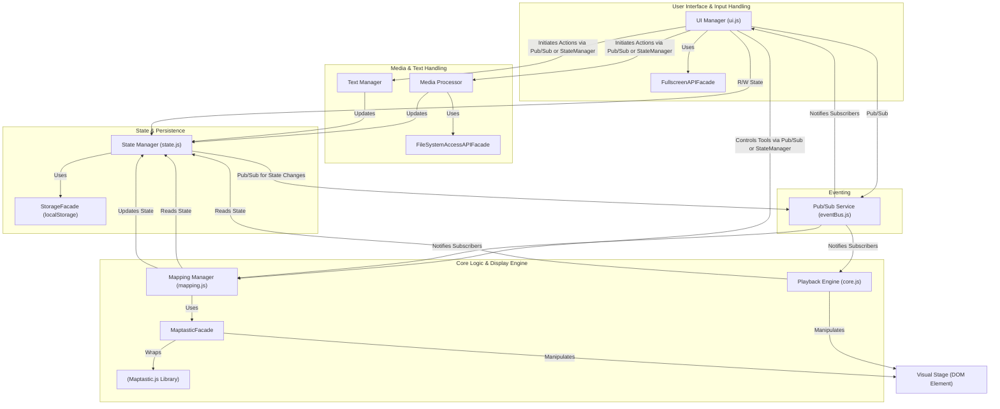

# Component View

The VJ Tam Tam application will be structured into several key logical components, each with distinct responsibilities. [cite: 56] These components will communicate using ES Modules and the Observer (Pub/Sub) pattern where decoupled interaction is beneficial. [cite: 57]
The main components are: `UI Manager`, `Playback Engine`, `Mapping Manager`, `State Manager`, `Media Processor`, `Text Manager`, various `Facades`, and a `Pub/Sub Service`. [cite: 58]

