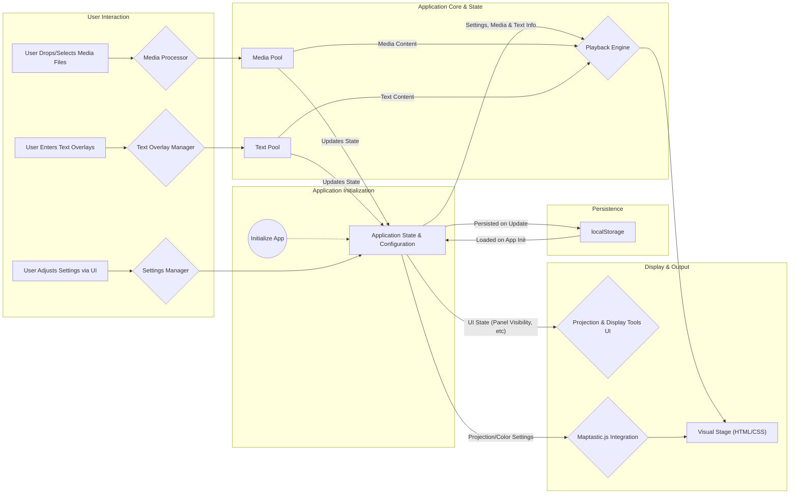

# High-Level Overview

VJ Tam Tam is architected as a **client-side monolithic application**. [cite: 31]
All application logic, including media processing, playback control, UI rendering, and state management, resides and executes within the user's web browser. [cite: 32]
There is no backend server component for the core functionality. [cite: 33]
The entire codebase will be contained within a **single repository (Monorepo)**, facilitating straightforward deployment to GitHub Pages. [cite: 34]
The primary user interaction flow begins with the user providing media to the application. [cite: 35]
Once media is loaded, the application automatically initiates a continuous, randomized playback of segments from this media pool. [cite: 36]
Users can interact with a minimalist UI to add more media, manage text overlays, and access advanced display controls. [cite: 37]
All settings and configurations are persisted in the browser's `localStorage`. [cite: 38]
Conceptually, the data flow can be visualized as follows:

