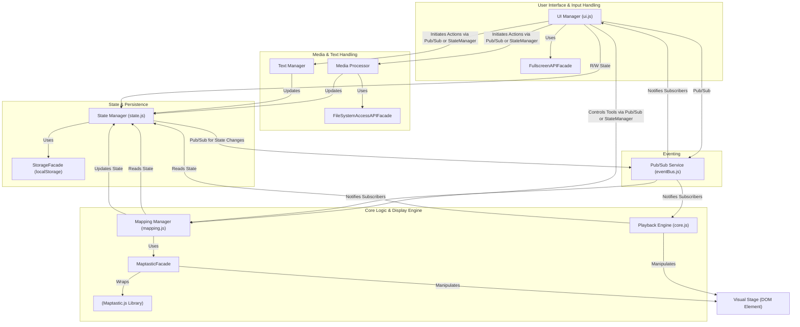

## 5. Architectural / Design Patterns Adopted

The following architectural and design patterns are proposed for the VJ Tam Tam project to ensure a well-structured, maintainable, and scalable client-side application:

- **Module Pattern (via ES Modules):** We will use ES Modules (`import`/`export`) to organize code into distinct, reusable, and manageable JavaScript files. [cite: 50]
- **Observer Pattern (Publish/Subscribe or "Pub/Sub"):** This pattern will facilitate decoupled communication between different parts of the application (e.g., state changes notifying UI components). [cite: 51]
- **Facade Pattern:** We will use facades to provide simplified, higher-level interfaces to more complex subsystems or libraries like Maptastic.js, FileSystemAccessAPI, and `localStorage`. [cite: 52]
- **State Management Pattern (Custom Centralized State with Defined Mutators):** A central JavaScript object will hold the application's shared state. Access and modifications will be handled through defined functions (mutators), and changes will be broadcast using the Observer pattern.
- **Singleton Pattern:** For certain global services or managers where only one instance should exist (e.g., a StorageFacade or a global Pub/Sub dispatcher), the Singleton pattern will ensure a single point of access. [cite: 55]

## 6. Component View

The VJ Tam Tam application will be structured into several key logical components, each with distinct responsibilities. [cite: 56] These components will communicate using ES Modules and the Observer (Pub/Sub) pattern where decoupled interaction is beneficial. [cite: 57]
The main components are: `UI Manager`, `Playback Engine`, `Mapping Manager`, `State Manager`, `Media Processor`, `Text Manager`, various `Facades`, and a `Pub/Sub Service`. [cite: 58]

