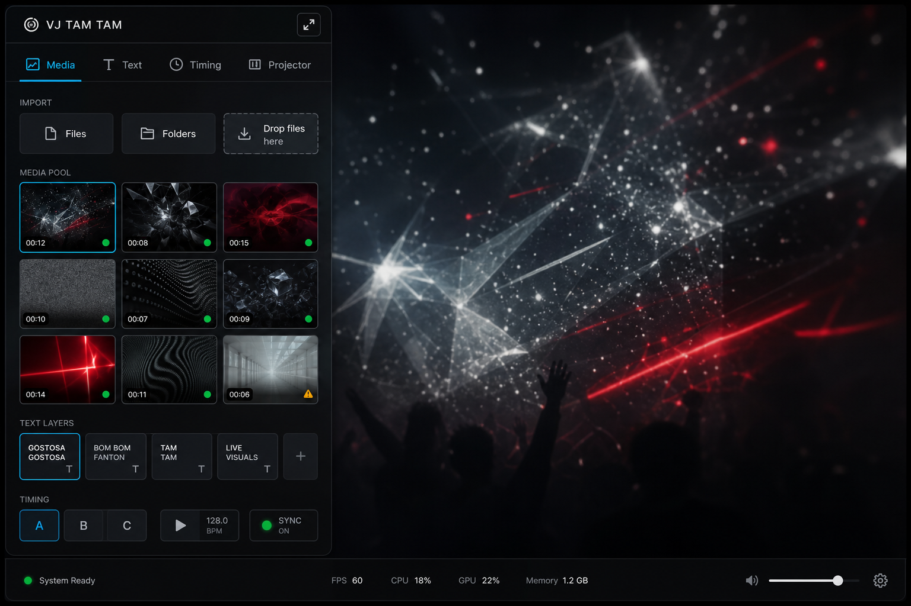
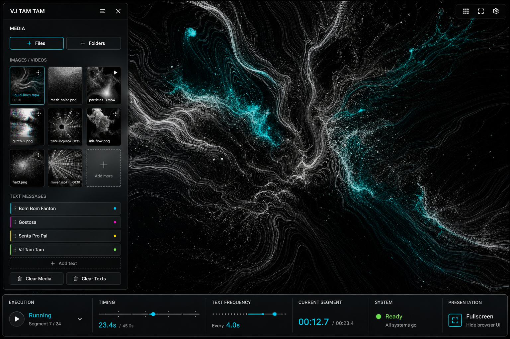
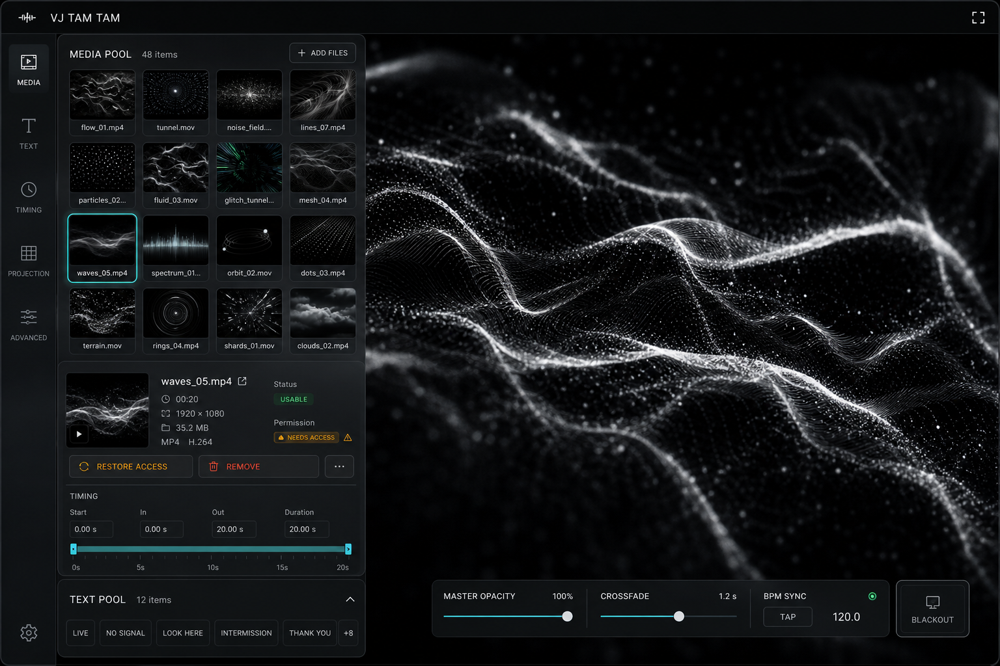
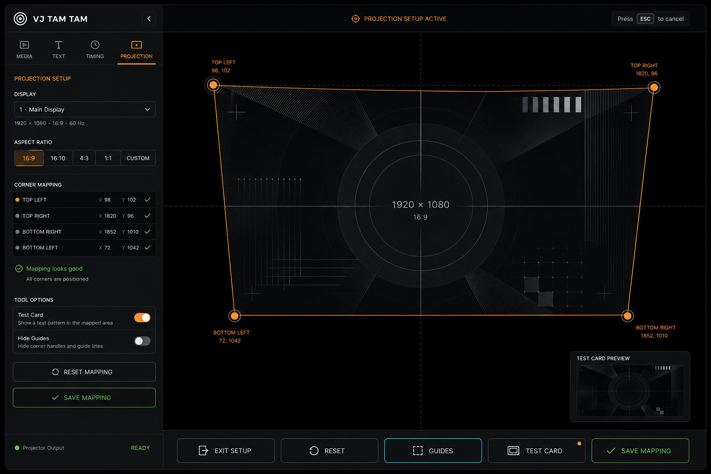

# UI Controlled Experiments - 2026-06-11

These generated mockups test structural alternatives after the first Signal Desk implementation slice. They are not implementation specs; they are decision probes.

## A. Tabbed Signal Drawer

Hypothesis: keep everything in the left drawer, but introduce top-level tabs so Media, Text, Timing, and Projector have clearer ownership.

What worked:
- Best direct evolution of the current implementation.
- Tabs make the drawer easier to scan without inventing a new layout model.
- Import affordances and media grid are clearer than the current app.

Risk:
- Tabs can hide live controls if the performer needs Media and Timing at the same time.
- It is still a fairly heavy drawer.

Verdict: good candidate for the next incremental app slice if we want the least architectural disruption.

## B. Lean Drawer + Bottom Live Strip

Hypothesis: keep media/text in a narrower drawer and move live status/timing/presentation controls into a bottom operator strip.

What worked:
- Strongest performance-mode idea. Timing, segment state, frequency, readiness, and fullscreen become glanceable.
- Drawer can stay simpler and more content-focused.
- Makes the app feel more like a live tool and less like a file manager.

Risk:
- Bottom strip may be too persistent for a VJ stage unless it also obeys idle hiding.
- It introduces a second UI surface, so idle behavior and mobile behavior need careful design.

Verdict: most promising direction for a more ambitious second UI pass.

## C. Media Grid + Inspector

Hypothesis: media-heavy sessions need an inspector panel for selected files, permissions, metadata, and per-item actions.

What worked:
- Best solution for the FileSystem Access / permissions complexity.
- Makes restore/remove/status less hidden than hover-only controls.
- Text pool can become a secondary strip without competing with large media pools.

Risk:
- Could overfit to file-management mode and make quick party use feel too technical.
- Needs careful empty and no-selection states.

Verdict: useful as a Media tab pattern, especially once real collections get larger.

## D. Dedicated Calibration Mode

Hypothesis: projection setup should be a distinct mode, not just extra controls inside Advanced Settings.

What worked:
- Clearest projection story by far.
- Guide lines, coordinates, corner list, test-card preview, and bottom action bar make calibration legible.
- The warmer orange edit state feels appropriate only here.

Risk:
- Requires deeper projection UI work and probably some state refactoring.
- Needs a disciplined exit path so performers do not get stuck in setup mode.

Verdict: use this as the target for projection setup. Do not try to squeeze this whole experience into the normal drawer.

## Synthesis

The strongest combined path is:

1. Keep the current Signal Desk drawer as the base.
2. Borrow **A** for tab/section organization if the current long drawer starts feeling cramped.
3. Borrow **B** for a future live-performance strip, but only if it hides cleanly with idle mode.
4. Borrow **C** inside the Media area when permission restore and selected-media actions need to become more understandable.
5. Treat **D** as the real projection-mode north star.

Immediate next UI bet: do **not** redesign everything again. Add one small architecture hook that lets normal performance mode and projection setup mode have distinct chrome. That lets the app grow toward B and D without prematurely rewriting the whole drawer.
