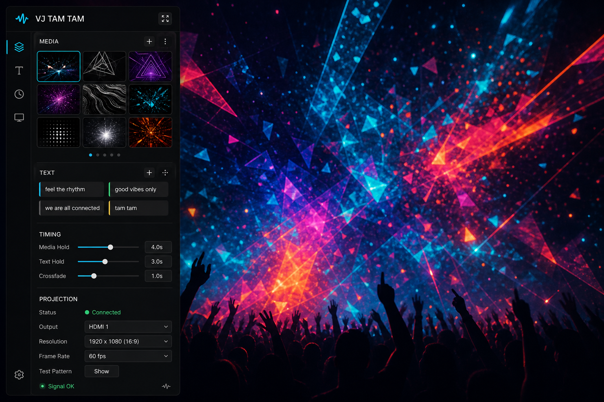
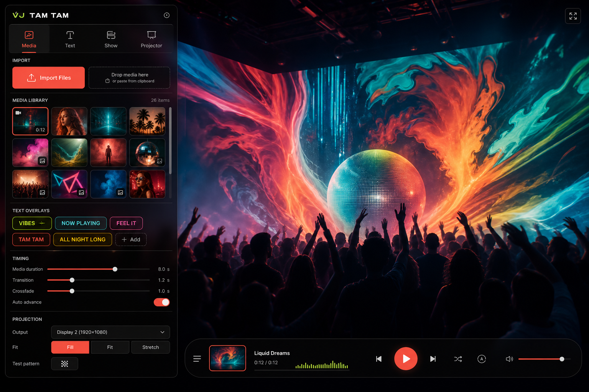
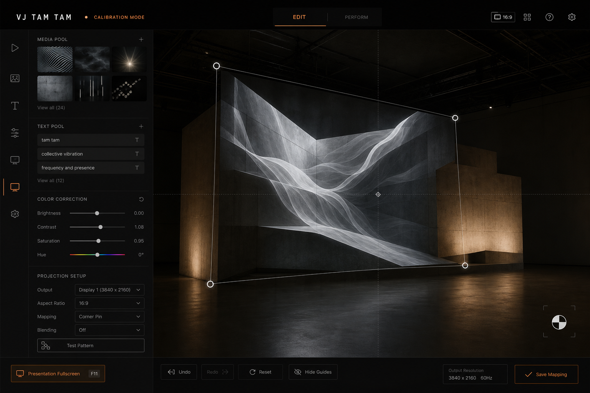

# UI Redesign Directions - 2026-06-11

This note captures the first generated UI direction set for the next VJ Tam Tam redesign pass. These are concept references, not implementation specs to copy literally.

## Recommendation

Use **Signal Desk** as the main app direction. It best matches the real product: a performance tool where the stage is sacred, the drawer appears only during interaction, and controls must be dense, readable, and low-light friendly. Borrow the friendlier import affordances and colored text chips from **Tropical Night Booth**. Use **Blackbox Calibration** only when projection setup is active, especially for handles, guide lines, edit-mode emphasis, and save/reset controls.

The hybrid target is: **a calm AV operator drawer for normal performance, with warmer party accents where people add media/text, and a precise blackbox calibration mode when mapping the projector.**

## Generated References

### Signal Desk



What to keep: compact rail plus section hierarchy, calm graphite glass, cyan active state, thumbnail grid density, status dots, readable timing/projection controls, small presentation fullscreen action.

What to avoid copying literally: concert-stock stage background, too many synthetic media thumbnails, waveform/logo ornamentation if it competes with the real app identity.

Implementation notes:
- Keep the left drawer as the main control surface, but reorganize it into clearer groups: Media, Text, Timing, Projection.
- Replace thick brutalist borders with subtle separators, 6px radii, and state color.
- Keep controls compact; the app is operated repeatedly, not read like a landing page.
- Use cyan for active/selected, green for healthy/ready, amber for warnings/permissions.

Prompt used:

```text
Use case: ui-mockup
Asset type: high-fidelity desktop UI concept mockup for VJ Tam Tam redesign
Primary request: Create a polished desktop web app UI mockup for "VJ Tam Tam", a live VJ projection tool. Fullscreen stage is primary, showing vibrant abstract party visuals. A translucent matte-black left drawer overlays the stage and is designed to fade away during idle mode. Drawer contains compact media thumbnail grid, text message chips, timing sliders, projection setup controls, and a minimal presentation fullscreen icon button. Professional AV console aesthetic: graphite panels, soft white text, cyan active states, green healthy indicators, amber warnings, crisp 6px radius, refined dividers, no brutalist thick borders, no marketing hero. The UI should feel performance-ready, low-light, dense but calm. Use simple legible labels only: Media, Text, Timing, Projection. Avoid fake paragraphs, avoid excessive tiny text, avoid rounded pill overload, avoid purple gradients.
```

### Tropical Night Booth



What to keep: warmer import area, friendly segmented navigation, colorful text chips, party energy restrained to accents, larger obvious primary actions.

What to avoid copying literally: bottom media-player transport, too much coral/red dominance, celebrity/stock-looking thumbnail content, UI that feels like a consumer music player rather than a projection tool.

Implementation notes:
- Use this direction to humanize the Media and Text sections.
- Make add/import actions obvious without turning the whole drawer into a toy.
- Let user media provide most of the color; accent colors should be rare and meaningful.
- A tabbed drawer could work later, but only if it improves access to Media/Text/Show/Projector without hiding critical live controls.

Prompt used:

```text
High-fidelity desktop UI mockup for "VJ Tam Tam", an approachable live party visuals app. Fullscreen stage with colorful photo/video visuals. A translucent black-glass left drawer overlays the stage and hides during idle. Drawer uses segmented tabs labeled Media, Text, Show, Projector; large import/drop controls; square media thumbnails; colorful text chips; readable timing sliders; compact projection controls; small fullscreen icon. Palette: charcoal, soft white, coral, lime, cyan, warm yellow accents. Polished modern party-tool aesthetic, friendly but not childish, performance-ready in a dark room. No marketing page, no brutalist boxes, no purple-dominant gradient, no tiny unreadable text.
```

### Blackbox Calibration



What to keep: dedicated calibration mode, elegant corner handles, guide lines, restrained orange edit state, bottom action strip for reset/hide guides/save mapping, aspect/output controls that feel precise.

What to avoid copying literally: making the whole normal app this austere, using architectural gallery imagery as the default stage, persistent top chrome that steals space from performance mode.

Implementation notes:
- Projection mode should visually change language: fewer party accents, more precision.
- Move corner handles and guide lines toward this calmer calibration look.
- Separate calibration actions from normal drawer actions: Reset, Hide Guides, Test Pattern, Save Mapping.
- Use orange only for edit/calibration state, not ordinary active state.

Prompt used:

```text
High-fidelity desktop UI mockup for "VJ Tam Tam", a projection mapping and live visuals tool in calibration mode. Fullscreen blackbox stage dominates, showing media warped to a projection surface with four elegant draggable corner handles, thin calibration guide lines, subtle test-card overlay hint, and precise aspect-ratio controls. A minimal translucent left drawer contains media thumbnails, text pool, color correction sliders, projection setup controls, and presentation fullscreen icon. Gallery installation aesthetic: deep black, smoked gray, warm white, muted blue, restrained safety orange edit states. Quiet premium interface, precise typography, generous negative space, no brutalist borders, no marketing page, no purple-heavy gradients, no tiny unreadable text.
```

## Next Implementation Slices

1. Redesign the default drawer shell: header, presentation fullscreen action, grouped sections, dark glass material, compact spacing, and idle transition.
2. Redesign Media and Text sections together using the Tropical Night affordances: better import zone, thumbnails, text chips, and clear empty states.
3. Redesign Timing and Projection controls using Signal Desk density and Blackbox Calibration precision.
4. Give projection mode a distinct calibration state: handles, guides, test-card affordance, and a focused action strip.
5. Only then revisit deeper UI architecture. The current `TextPoolView`, CSS feature files, and app smoke tests are enough to start the first visual slice safely.
