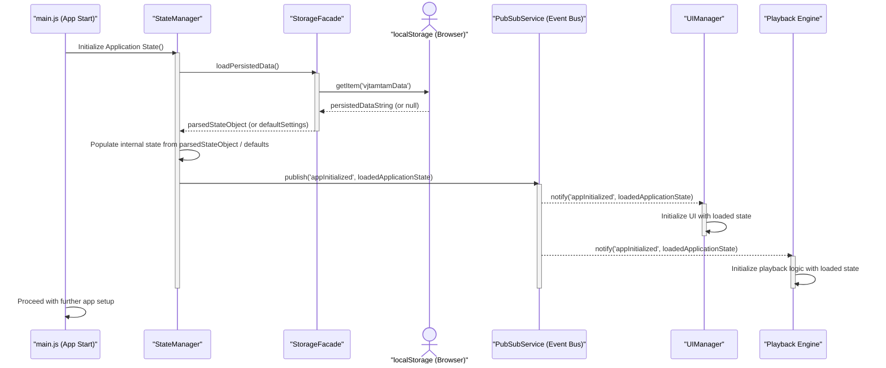
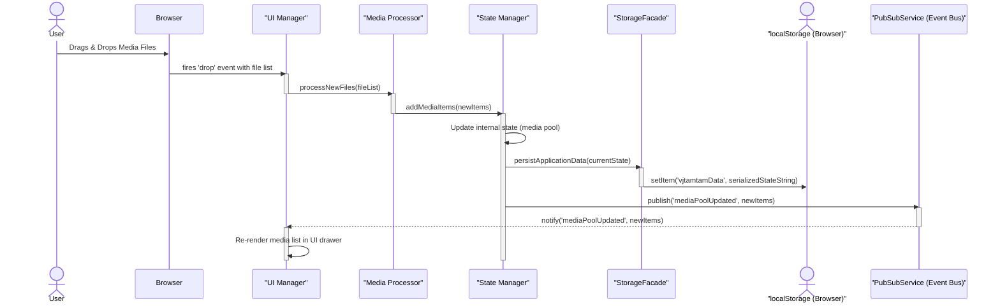
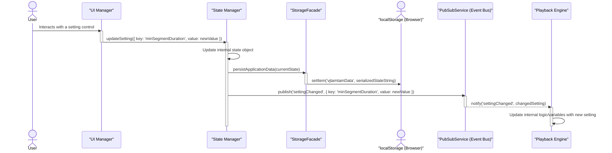

## 10. Core Workflow / Sequence Diagrams
This section illustrates key workflows. [cite: 79]

### Sequence Diagram 1: Application Initialization & State Loading

### Sequence Diagram 2: User Adds New Media & Persistence

### Sequence Diagram 3: User Changes a Setting & Playback Reacts
